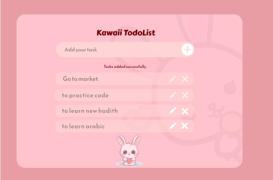
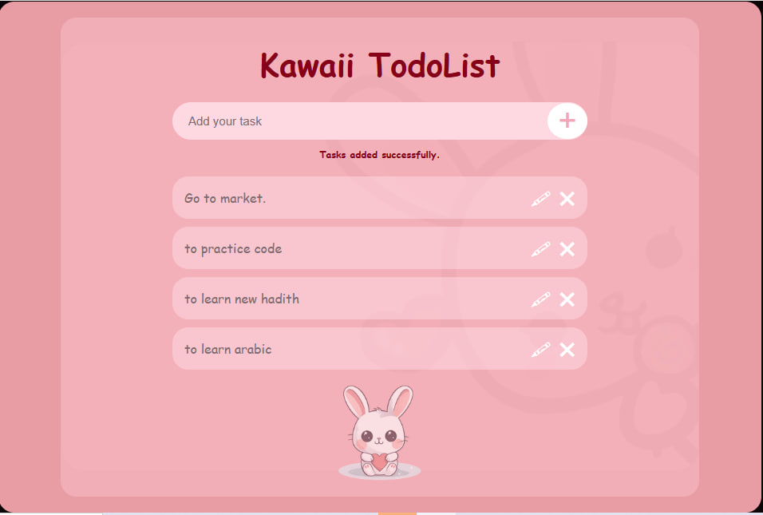

# Kawaii Todo List

## Project Description

Kawaii Todo List is a responsive To-Do List user interface created using only HTML and CSS. The goal of this project was to recreate a Figma design into a real webpage by focusing on layout, colors, background images, typography, spacing, and styling.

This project does not include JavaScript functionality yet. It focuses only on creating the visual design and making the page responsive for different screen sizes.

## Design Comparison

### Original Figma Design

### Final Webpage Output

## What Was Easy

The easy part was creating the basic structure using HTML and styling the main sections with CSS. Adding colors, fonts, borders, and positioning elements was simple after understanding the Figma design.

## What Was Difficult

The difficult part was matching the design exactly, especially adjusting the background image opacity, colors, spacing, and making the layout responsive.

## My Approach

I first analyzed the Figma design and identified the main sections of the page. Then I created the HTML structure and used CSS to match the design. I adjusted sizes, colors, and positions step-by-step until the final result looked close to the original design.